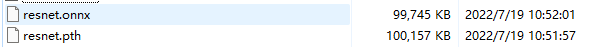
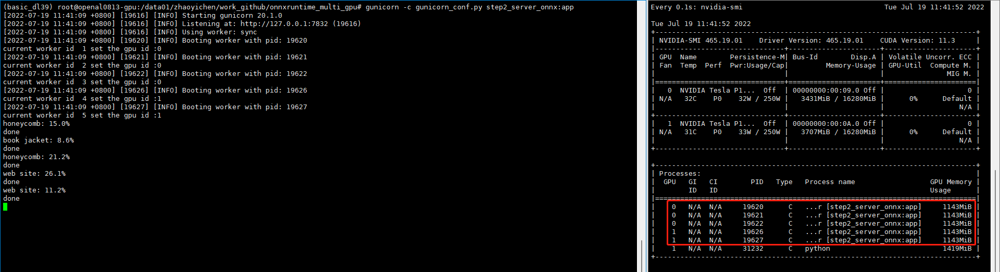

# 项目概述
当我们训练完成一个深度学习模型后，可以使用gunicorn+flask进行部署，其中使用onnxruntime框架进行模型推理加速做核心的计算，同时本项目还支持多GPU部署（还可以指定每张卡上部署的进程数）

# 1.导出onnx模型
```python
python step1_pytorch2onnx.py
```


## 1.1.对比推理速度
```python
python vs_run_time.py
# PyTorch 0.010762120762025006 , ONNX 0.004936059196013957 , ONNX2 0.0047725455259205775
```
发现onnxruntime的图片推理速度比原生的pytorch快一倍多

# 2.部署onnx服务
首先，编写gunicorn配置文件gunicorn_conf.py
可以再step2_server_onnx.py里的set_process_gpu中根据显卡使用情况，分配进程
## 2.1.启动服务（5进程）
控制台执行
```commandline
gunicorn -c gunicorn_conf.py step2_server_onnx:app
```

可以看到我们在卡0上分配了3个进程，卡1上分配了2个进程

## 2.2.客户端调用（2k张图像）
```python
python client.py
# 753.7857494950294
# 等待所有线程执行完成
# ===============close===============
# 6.0930845737457275
```

# 3.部署pytorch服务做对比
## 3.1.启动服务（5进程）
控制台执行
```commandline
gunicorn -c gunicorn_conf.py step3_server_pytorch:app
```

## 3.2.客户端调用（2k张图像）
```python
python client.py
# 753.7855133414268
# 等待所有线程执行完成
# ===============close===============
# 8.30529260635376
```
可以看到onnx精度上几乎可以逼近pytorch，速度上onnx比pytorch快2.2秒，

# 4.在ImageNet val（5w）上测试（8进程）
## 4.1. onnx结果
19635.193501168862
等待所有线程执行完成
===============close===============
151.3771858215332

## 4.2. pytorch结果
19635.191890196875
等待所有线程执行完成
===============close===============
171.36499762535095

## 4.3. 结论
onnx在精度上会有一定的损失，但是几乎不影响最终预测结果，速度上有显著优势